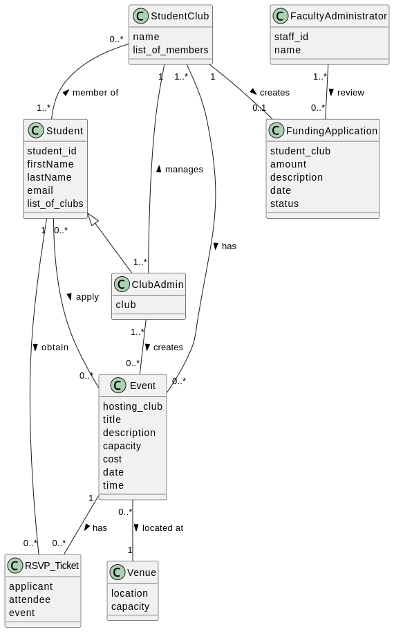

Team Name: **tv_addicts**

| Name         | Student ID | UniMelb Username | GitHub Username | Email                           |
| ------------ | ---------- | ---------------- | --------------- | ------------------------------- |
| Sameer Sikka | 1169800    | SSIKKA           | SamSike         | ssikka@student.unimelb.edu.au   |
| Mingda Zheng | 1382885    | mingdaz1         | MnnDa           | mingdaz1@student.unimelb.edu.au |
| Haitian Wang | 1467513    | HAITIANW         | Morty931        | haitianw@student.unimelb.edu.au |
| Luyun Li     | 1586333    | luyunli          | lucy-lulu       | luyunli@student.unimelb.edu.au  |

# Domain Model Diagram

# Domain Model Explanation

This document explains the domain model we build for the application designed to manage student clubs and events at The University of Melbourne.

## Entities and Relationships

According to application description, we select these entities: **Student**, **StudentClub**, **Club_Admin**, **Event**, **RSVP_Ticket**, **Venue**, **FundingApplication**, **FacultyAdministrator**

In the description: Students with Admin privileges can create, amend or cancel events, and also add or remove admin users of the club. We interpret it as: ClubAdmin should inherit Student class.
**We represent this as**: `Student <|-- Club_Admin`

In the description: Students can join various Student Clubs, and Student Clubs can have numerous members. We interpret this as: A Student Club can have multiple Students as members AND a Student can be a member of multiple Student Clubs, but it is also possible for a Student to not be a member of any Student Club.
**We represent this as**: `StudentClub "0..*" -- "1..*" Student : member of <`

In the description: Students can RSVP to multiple Events, but each Ticket is personal. We interpret it as: A Student can obtain zero or more Tickets for Events AND each Ticket is associated with exactly one Student.
**We represent this as**: `Student "1" -- "0..*" Ticket : obtain >`

In the description: Each Student Club can only submit one Funding Application per semester. But since this application will be used for more than one semester, each Student Club can have multiple Funding Applications over time. We interpret it as: A Student Club can create multiple Funding Applications AND each Funding Application is linked to exactly one Student Club.
**We represent this as**: `StudentClub "1" -- "0..*" FundingApplication : creates >`

In the description: Student Clubs organize various Events, and each Event needs one organizing Student Club. We interpret it as: A Student Club can create zero or more Events AND each Event is associated with exactly one Student Club.
**We represent this as**: `StudentClub "1..*" -- "0..*" Event : creates >`

In the description: Events must include Venue as a detail. We interpret it as: An Event must have a Venue but each Venue does not need to have an Event.
**We represent this as**: `Event "0..*" -- "1" Venue : located at >`

In the description: A Student can RSVP to an Event. We interpret it as: A Ticket can be bought for an Event (or RSVP'ed), and an Event can have zero or more tickets bought (or RSVP'ed to).
**We represent this as**: `Event "1" -- "0..*" RSVP_Ticket : has >`

In the description: Faculty Administrators are responsible for evaluating Funding Applications, and each Funding Application must be assessed by the Faculty Administrator. We interpret it as: A Faculty Administrator can review zero or more Funding Applications AND each Funding Application is reviewed by at least one faculty administrator.
**We represent this as**: `FacultyAdministrator "1..*" -- "0..*" FundingApplication : review >`

## Entities details

### 1. **Student**

-   **Attributes:**
    -   `student_id`: Unique identifier for each Student.
    -   `firstName`: First name of the Student.
    -   `lastName`: Last name of the Student.
    -   `email`: Contact email for the Student.
    -   `list_of_clubs`: List of Clubs that the Student is a member of.

### 2. **StudentClub**

-   **Attributes:**
    -   `name`: Name of the Student Club.
    -   `list_of_members`: List of Students that are members of the Student Club.

### 3. **ClubAdmin**

-   **Attributes:**
    -   `club`: The Student Club that this Club Admin manages.

### 4. **Event**

-   **Attributes:**

    -   `hosting_club`: The Student Club organizing the Event.
    -   `title`: Title of the Event.
    -   `description`: Detailed description of the Event.
    -   `capacity`: Maximum number of attendees (optional).
    -   `venue`: Location of the Event, either online or in-person.
    -   `cost`: Expenditure for the Event, limited to total funds received using Funding Application.
    -   `date`: Date of the Event.
    -   `time`: Time of the Event.

### 5. **RSVP_Ticket**

-   **Attributes:**

    -   `applicant`: The Student who applied for the Ticket.
    -   `attendee`: The Student attending the Event using this Ticket.
    -   `event`: Event for which this Ticket is bought for.

### 6. **FundingApplication**

-   **Attributes:**
    -   `student_club`: The Student Club applying for funding.
    -   `amount`: Amount of money requested.
    -   `description`: Description of intended use of funds by Student Club to hold Events.
    -   `date`: Date of submission of the Funding Application.
    -   `status`: Current status of the Funding Application (In Draft, Submitted, In Review, Approved, Rejected).

### 7. **FacultyAdministrator**

-   **Attributes:**
    -   `staff_id`: Unique identifier for each Faculty Administrator.
    -   `name`: Name of the Faculty Administrator.

### 8. **Venue**

-   **Attributes:**
    -   `location`: Location at which Venue is located.
    -   `capacity`: Maximum capacity for attendees of this Venue.
